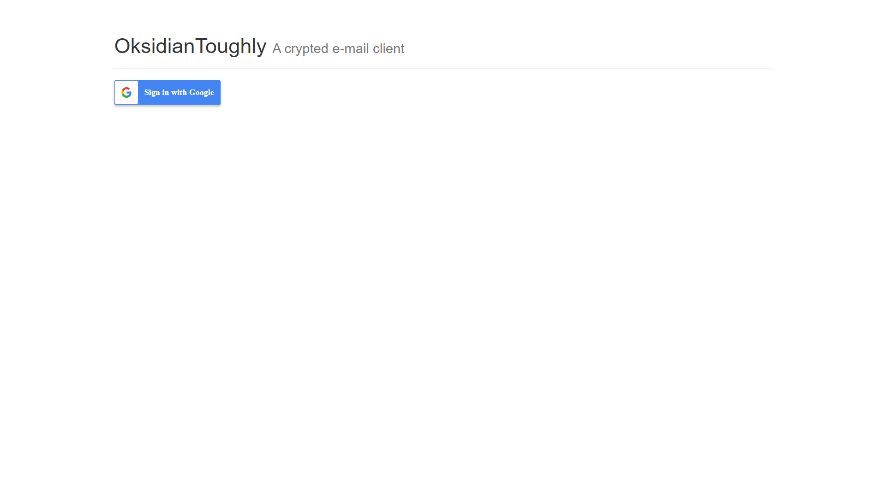
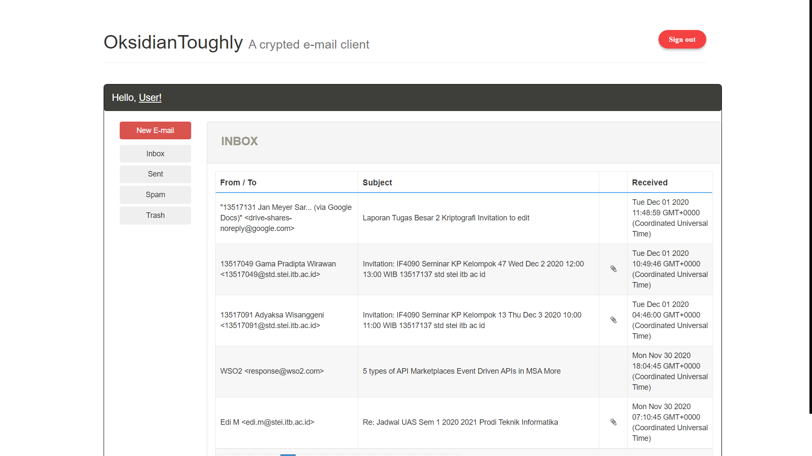
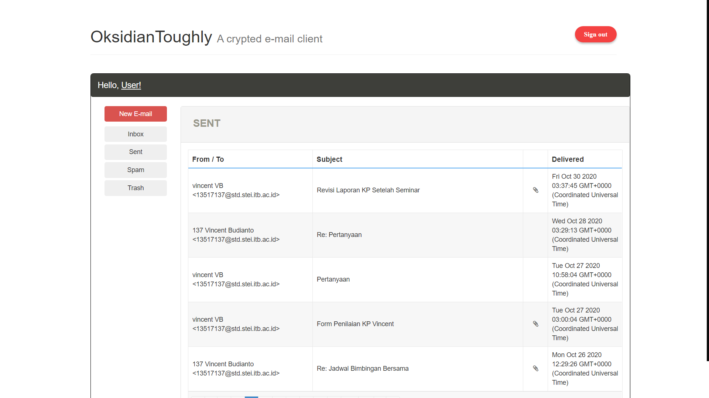
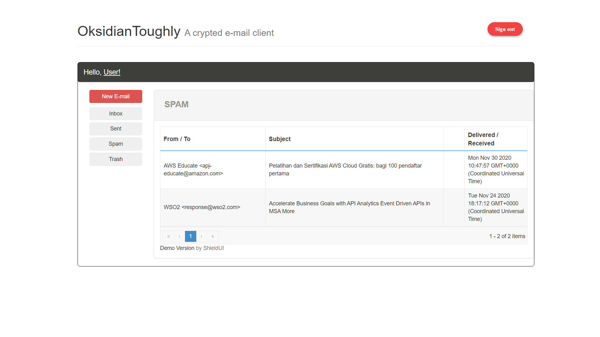
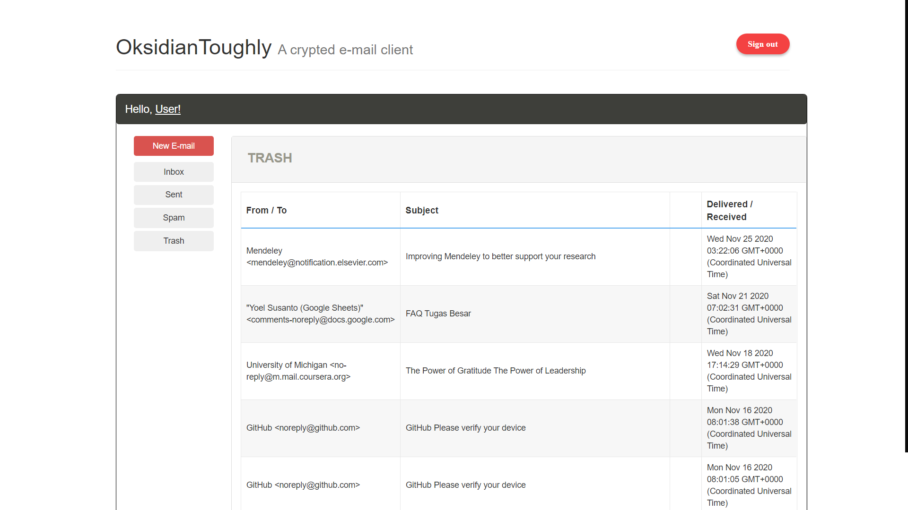
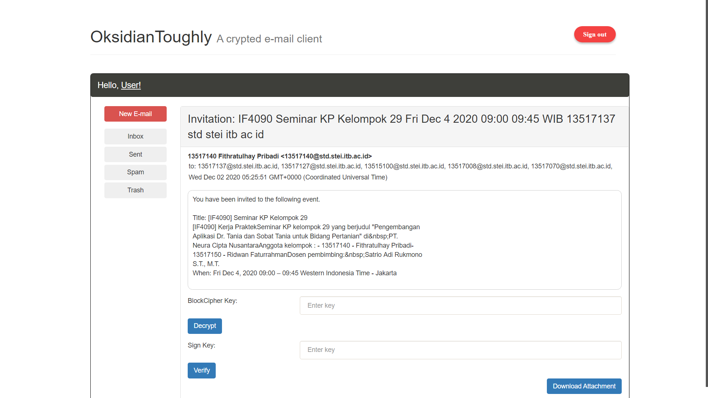
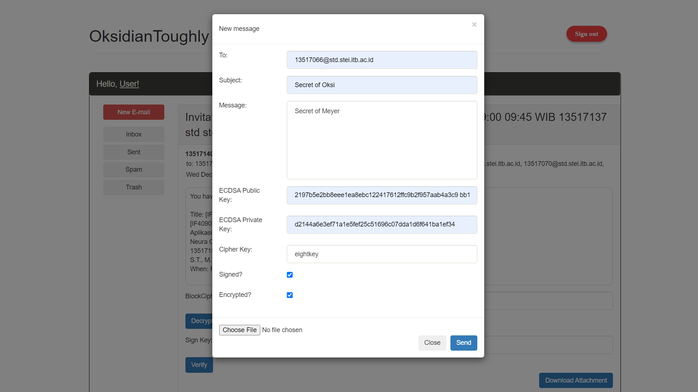

<h1 align="center">
    <b>
        <br>
        Tugas Besar 2 IF4020 Kriptografi
        <br>
    </b>
</h1>

<h2 align="center">
    <b>
        OksidianToughly
        <br>
        <br>
    </b>
</h2>

## Deskripsi Singkat
Membuat aplikasi klien surel sederhana pada perangkat mobile yang dilengkapi dengan fitur enkripsi/dekripsi dan fitur tanda tangan digital. Surel dienkripsi dengan algoritma block-cipher yang sudah anda buat sebelumnya, sedangkan tanda tangan digital dibangkitkan dengan kolaborasi algoritma ECDSA (Elliptic Curve Digital Signature Algorithm) dan fungsi hash Keccak (SHA-3).

Tanda tangan digital bergantung pada isi surel dan kunci. Tanda-tangan digital direpresentasikan sebagai karakter-karakter heksadesimal dan ditaruh pada akhir surel. Untuk membedakan tanda-tangan digital dengan isi dokumen, maka tanda-tangan digital diawali dan diakhiri dengan tag <ds> dan </ds>, atau tag lain (diserahkan kepada anda).

Contoh:
```
<ds>4EFA7B223CF901BAA58B991DEE5B7A</ds>
```
atau
```
*** Begin of digital signature ****
4EFA7B223CF901BAA58B991DEE5B7A
*** End of digital signature ****
```

Contoh surel dan tanda tangan digital yang diberi tanda-tangan dengan aplikasi PGP:
```
Kepada Yth.
Bapak Dekan
Di Tempat

Dengan hormat.
Bersama surat ini saya ingin mengabarkan bahwa nilai skripsi mahasiswa yang bernama Faisal Saleh dengan NIM 13902021 adalah 86,5 atau dalam nilai indeks A. Sidang skripsi sudah dilakukan pada Hari Rabu Tanggal 21 Januari 20 Juli 2005.

Atas perhatian Bapak saya ucapkan terima kasih.

Bandung, 25 Juli 2005
Dosen Pembimbing Skripsi

Ir. Ahmad Agus

-----BEGIN_PGP_SIGNATURE-----
iQA/AwUAQnibsbPbxejK4Bb3EQJXvQCg8zN6UL0xnwBTPR5
FfWNt4uxh3AEAn2NC/G2VTUrLpcSyo2l/S/D/+rUl=pZeh
-----END_PGP_SIGNATURE-----
```

Program memiliki spesifikasi sebagai berikut:
<ol>
	<li>Klien surel dilengkapi dengan menu untuk membangkitkan kunci publik dan kunci privat berdasarkan Elliptic Curve Cryptography</li>
	<li>Klien surel memiliki editor untuk mengetikkan isi surel, memasukkan alamat surel penerima, mengetikkan subyek surel, dll</li>
	<li>Klien surel dapat menampilkan inbox, sent email, dan fitur-fitur umum yang terdapat di dalam klien surel</li>
	<li>Klien surel boleh menyediakan attachment, tetapi file yang di-attach tidak perlu dienkripsi</li>
	<li>Pengguna dapat memilih apakah surel dienkripsi atau tidak (ada toggle icon untuk memilihnya)</li>
	<li>Pengguna dapat memilih apakah surel ditandatangani atau tidak (ada toggle icon untuk memilihnya)</li>
	<li>Jika pengguna memilih mengenkripsi/dekripsi surel, maka klien surel meminta pengguna memasukkan kunci</li>
	<li>Isi surel dienkripsi/dekripsi dengan block cipher yang sudah dibuat pada tugas pengganti UTS</li>
	<li>Program Keccak (SHA-3) harus dibuat sendiri (tidak menggunakan library atau fungsi built-in)</li>
	<li>Jika pengguna memilih menandatangani surel (baik surel terenkripsi atau tidak), maka klien meminta kunci privat, Untuk memverifikasi tanda tangan digital, klien surel meminta kunci public, Kunci public/privat dapat dibaca dari file atau diketikkan oleh pengguna</li>
	<li>Dapat digunakan pada sistem operasi mana saja (WindowsPhone, Android, iOS, dll)</li>
</ol>

## Tabel Fitur
| No | Feature                     | Success (✔) | Fail (❌) | Details |
|:--:|:----------------------------|:------------|:----------|:--------|
|  1 | Email Encryption            | ✔           |           |         |
|  2 | Email Signature             | ✔           |           |         |
|  3 | Send Email                  | ✔           |           |         |
|  4 | Inbox                       | ✔           |           |         |
|  5 | Sent Email                  | ✔           |           |         |
|  6 | Spam                        | ✔           |           |         |
|  7 | Trash                       | ✔           |           |         |
|  8 | Send Email Attachment       | ✔           |           |         |
|  9 | Download Attachment         | ✔           |           |         |

<br>

## Cara Run Program
1. Create project pada Google Cloud Platform dan aktifkan Gmail API.
2. Create credentials API untuk oAuth client ID dan API Key
3. Instalasi prerequisite libary dan package :
```bash
$ pip install numpy
$ npm install
```
4. Configurasi file `.env` dari template `example.env` kemudian isikan setiap variablenya dengan informasi yang sesuai
5. Jalankan server
```bash
$ node server.js
```
atau
```bash
$ nodemon server.js
```
6. Server akan berjalan pada port 8000

## Cara Menggunakan Email Client
1. Buka http://54.205.116.219.xip.io:8000 pada browser
2. Pilih sign-in dengan akun google
3. Accept permission untuk akses pada email
4. Email client siap digunakan

##### A. Cara Melakukan Enkripsi Email
1. Pilih `New E-mail` pada navigation bar
2. Isi form sesuai dengan informasi yang dibutuhkan untuk mengirimkan email (target    email, subjek email, isi teks email)
3. Memilih checkbox `encrypted`
4. Isi bagian `newCipherKey` denga  nilai kunci dengan panjang 8 karakter untuk    algoritma enkripsi
5. Jika ingin melampirkan file, file terlampir tidak akan dilakukan enkripsi, hanya isi teks email yang akan dilakukan proses enkripsi

##### B. Cara Melakukan Dekripsi Email
1. Pilih email yang ingin dilihat (dari inbox / sent / spam / trash)
2. Isi bagian `key` dengan nilai kunci dengan panjang 8 karakter untuk algoritma dekripsi
3. Klik button `Decrypt` untuk dekripsi
4. Hasil dekripsi akan muncul sebagai alert

##### C. Cara Melakukan Verifikasi Tanda Tangan Digital Email
1. Pilih email yang ingin dilihat (dari inbox / sent / spam / trash)
2. Isi bagian `key` dengan nilai kunci publik untuk algoritma ECDSA
3. Klik button `Verify` untuk dekripsi
4. Hasil verifikasi akan muncul sebagai alert

## Screenshot

### Login Page


### Inbox


### Sent Emails


### Spam


### Trash


### Message Preview


### Create Message


<br>

<p align="center">
    <b>
        <br>
        <font size="6">
            About
        </font>
    </b>
</p>

<p align="center">
    <b>
        IF4020-Kriptografi - 2020
        <br>
        Teknik Informatika 2017
        <br>
        <br>
        13517020 - T. Antra Oksidian Tafly
        <br>
        13517066 - Willy Santoso
        <br>
        13517131 - Jan Meyer Saragih
        <br>
        13517137 - Vincent Budianto
    </b>
</p>